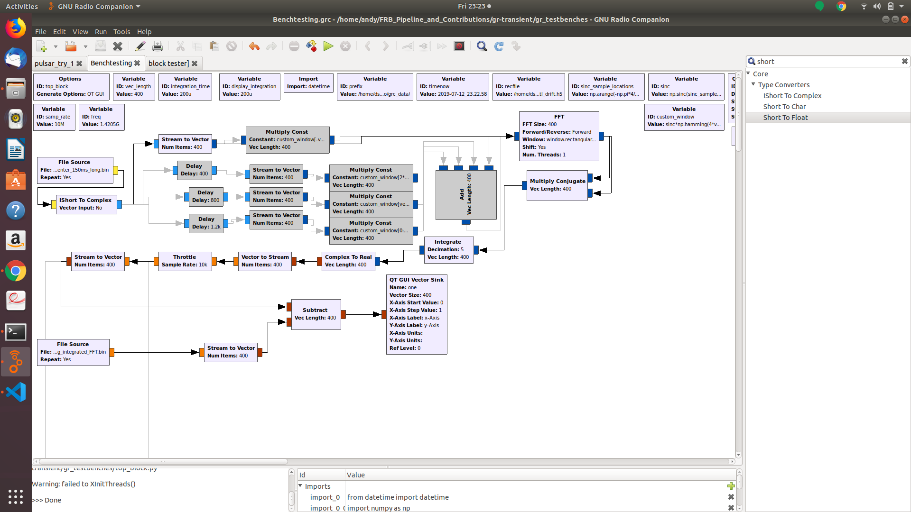
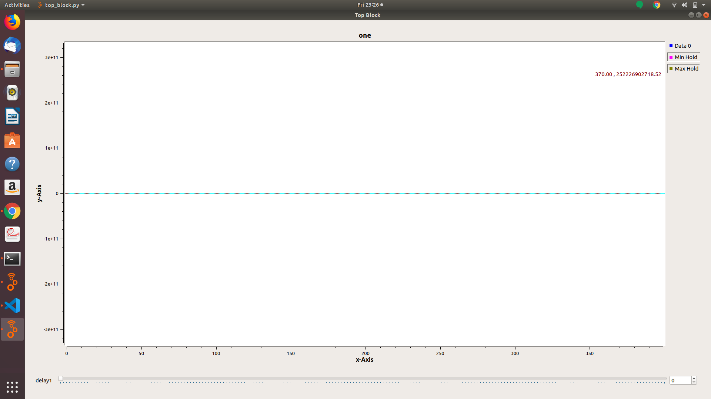
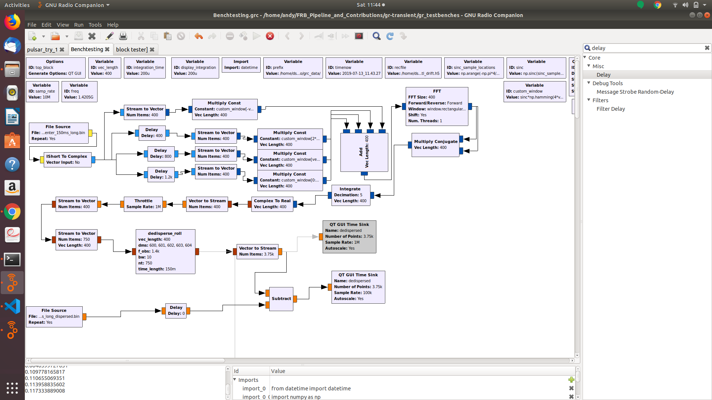
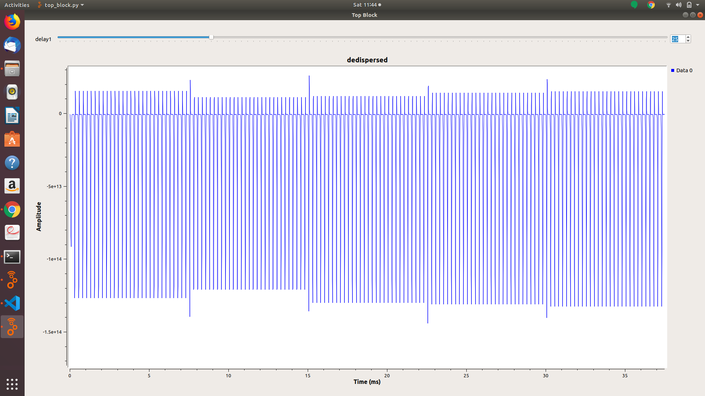
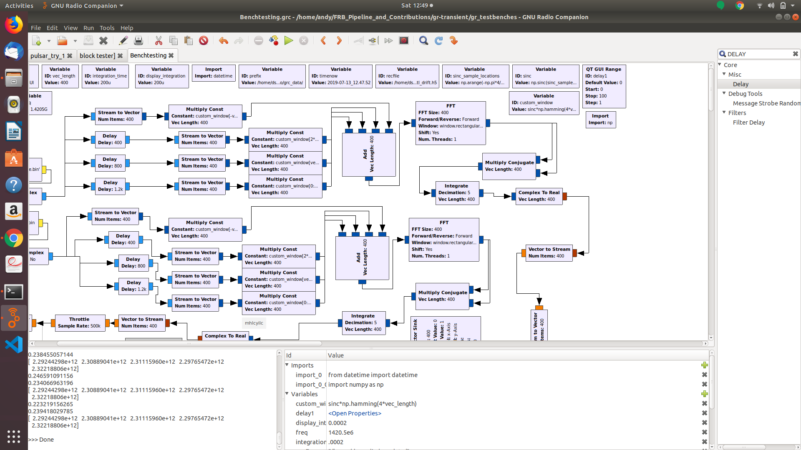
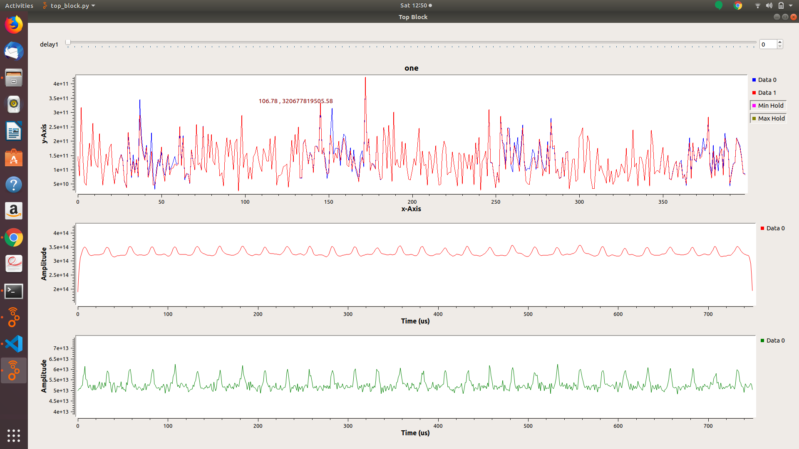
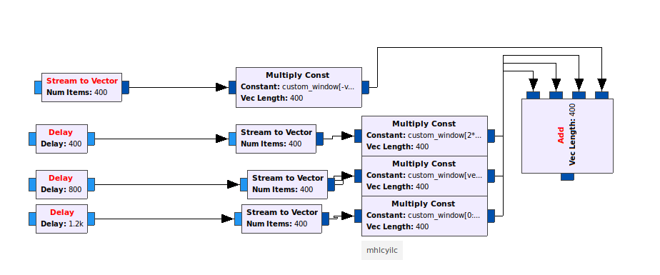
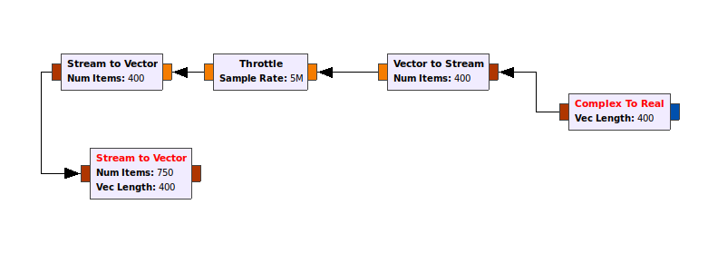
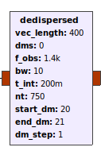
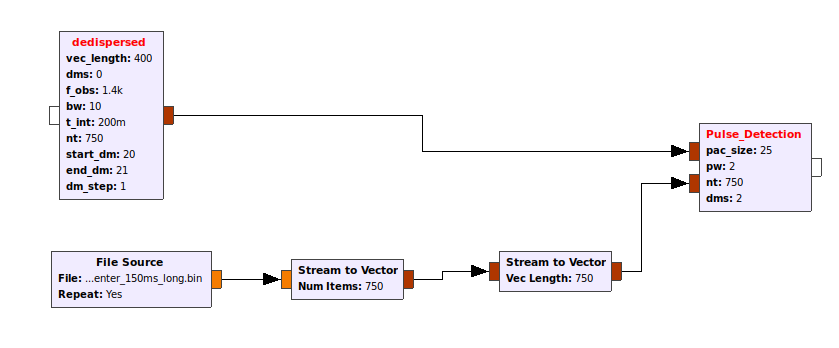

# GNURadio Test Benches

## List of Flow-graphs

1. Simulated pulse ->  sink
2. Simulated pulse -> Spectrometer -> sink
3. Simulated pulse -> Spectrometer -> dedisperser -> sink
4. Simulated pulse -> Spectrometer -> depdispersor -> detector -> sink
...
...
...

The benchtests were conducted by comparing the output of each bench test seen above, to the output given by the Jupyter notebook pipeline. The results from both sources are expected to be the same for each test.

* The first bench test gives two outputs.  
* One is difference of the sources and the other is one source untouched.  

* From the import block, the data is run through a Spectrometer, which stars at the delay blocks and ends with the integrate block. 
* The Spectrometer has a Polyphase FIlter Bank, which ensures that no one window gives an output that favours any one frequency. This begins at the delay block and ends with the add block
* The rest of the spectrometer consists of an FFT block, to a multiply cojugate block, to an integrate block
* The GNUradio flowgraph has a polyphase filter bank, while the Jupyter pipeline does not. With the PFB disabled, GNUradio and Jupyter give the same outputs. 
* With the PFB enabled, there is a phase shift introduced. This results in packets not being exactly aligned seen by the difference of the two. 
* The original amplitude of the packets was in the 1e14 range, a factor of 100 difference to the resulting difference.

* The data is turned into a float and throttled as a stream not as a vector. After throttle, the data is turned into a matrix, and run through the dedispersed block. 
*The delay time is not shown in the flowgraph, but the delay block has a delay of 25, and will be for all furtherbenchtesing
* 25 is the size of a pulse packet after the spectrometer.

* When PFB was disabled, the difference between GNUradio and Jupyter was negligable. DMs 600 to 604 were tested [Figure 8](Simulated_pulse_to_Spectrometer_to_dedisperser_to_sink_PFB_disabled.png)
* It is unclear why there is an increased differnce between Jupyter and GNUradio at the start of each new DM. 
* With the PFB enabled, the difference is worse as expected due to the phase shift, but is still reasonable .

* From there, the data is run through the dedisperse block. Data from the noise is also included. .
* Due to the matched filter in the block,it is difficult to take the difference between GNUradio and Jupyter. Therefore they are compared visibly. 
*The GNUradio pulse is the green plot, with Jupyter in red. Without the PFB  does not differ significantly from with the PFB 
* The gnuradio output will give a nonzero response only when a pulsar has been detected.

...
...
...

This section will be explaining how the completed flowgraph of the detection works.

* The flowgraph starts by importing the file that we wish to analyze using the file source block. 
 * The parameter asking to repeat the block is set to yes, to ensure that a steady pulse train is run through the flowgraph. 
 * The data type is whatever the instrument saving the data saved it as.
  * Typically, telescopes save int16 data

* The signal is changed into a complex type and run through a PFB filter. 
 * The delay from the PFB will be the number of frequency channels that are desired from the FFT. In this case, we will have 400 channels
 * 4 delays are used, and after each delay a different window is used. Then all streams are added together.
  * Each delay is a consecutive integer multiple of the vector length.

* The PFB was the first part of the Spectrometer. Next, the data is run through the FFT conjugate, and integrate blocks. 
 * The number of channels will be the same as the vector length, and a forward transform is needed to convert to frequency space.
 * The decimation in the integrate block determines how many time samples are generated. The value is given by the equation 
  * The display_integration variable is a time in seconds that must be less than the observed pulse width. A factor of two is acceptable

* The signal is converted to a float. In the case where the signal is coming from a file, then it is converted to a stream. 
 * The signal is throttled here because the block *on average* regulates the number of units it allows through. The throttle rate for a file does NOT need to be the same as the sampling rate. 
* When calculating in real time, the data is not converted to a stream

* The signal after being throttled is turned back into a vector with a length of the number of frequency channels. The vector stream is then run through another stream to vector block to turn it into a matrix.
 * The new length of the matrix is the number of time samples by frequency channels that we want. The number of time channels is found two ways. 
  * If running from a file, then the number of channels is 
  * If running live data, then there is no *size* of a file. Instead, take the sample rate and multiply it by the size of what you want a "file" to be. This gives the number of data points.
* The signal is then intriduced to the dedispersed block, which has multiple parameters 
 * `stat_dm` is the starting dm that will be observed at.
 * `end_dm`  is the last DMs that will be observed at.
 * `dm_step` indicates how many specific DMs want to be used between the previous two parameters.
 * `f_obs` is the observing frequency which is set to the centre frequency the telescope was observing at in MHz.
 * `bw` is the observing bandwidth of the telescope in MHz. This is generally decided by the sampling rate the data was taken at.
 * `nt` is the number of time samples, the same as in the previous stream to vector block.
 * `t_int` is the time length of each timestep.
  * For a file source, this is found by dividing the duration of the observation in milliseconds by the number of time channels.
  * For a live source, this is found by taking the number of time channels and dividing by the number that is significantly greater than the pulse width and again multiplying by the number of periods desired in the "file".
 * The block takes an input of size equal to nt*vec_length

* Finally, the signal is detected by the program 
 * The block takes two inputs. Input zero is the signal, and input one is the noise taken away from the source.
  * the noise is calculated in the noise flowgraph, which is exactly the same up to this point where the noise is saved to a file.
*Both signals are introduced into the Pulse detection block with the following parameters.
 * `nt` parameter is the number of time samples.
 * `pac size` is the length of each pulse packet in terms of time samples.
  * To find this with a either a file or live source 
   * p is the period, or the value that is significantly larger than the pulse width, and the decimation is the value calculated in the integrate block. 
 * The output of the block is determined if the block detects a pulsar or not.
  * If a pulsar is detected, then the matched filter between a gaussian pulse and the data is given.
  * If no pulsar, then the output is given as 0.
  * A pulsar is detected if the SNR is greater than 10 for more than 5 DMs, the program will save that part of the file or raw data. The DM with the higest amplitude is the one saved.

* The output from the detection block is then given to a vector to stream block, where the number of items is the `(number of timesteps)*(len(dms))`.
* This is then given to a time sink. In the event that a pulsar is found, the largest pulse from the DMS that passed are given.

...
...
...

Some final notes about the time sinks and outputs and limitations of the program. The vector output for the dedisperse block is the number of timesamples times the number of DMs, while the output for the detection block has a vector length of the number of time samples. The time sinks must have a sample rate equal to that of the throttle. Additionally, the throttle rate for the flowgraph is limited
to a maximum of 10e6 samples per second when using 100 DMs. This is due to the Pulsar detection block not being written in C, which will be updated in the next iteration of the program. 
